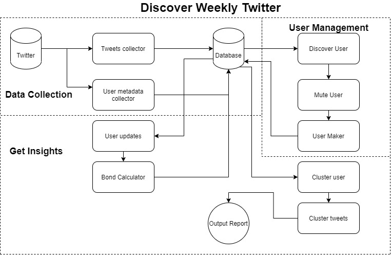

# Discover Weekly Twitter

### Introduction:
The project is an attempt to solve a real life problem that we face sometimes. Before moving into the project lets quickly understand the problem this project is attempting to solve.  
When using twitter, we engage ourselves with the content we like. So we interact with the tweets of our topic of interest and follow the people who are interested in the similar topics. Now if we want to know about what is going on in our twitter bubble then they are two ways. We can either go through the tweets on our timeline or look at the trending tab. Here the benefit of first method is we get a constructive understanding of things but it is highly in efficient as we cant go through a lot of data. The second method helps us when twitter segregates tweets of your interest but all the data is mostly random tweets which have a keyword so it does not give a proper insight of the data and you miss most of the undiscovered trending topics more personal to the bubble you are in because twitter may not show it.  
So a possible solution to the above problems is detect topics of discussion in the bubble and then for each topic we can segregate their conversations. By this we can detect unknown topics as well as gain a very detailed understanding of these topics.
So lets look at the project attempting to solve the above problem.

### Architecture:
  
The project is divided into 3 parts:  
1. Data Collection
2. User Management
3. Get Insights

Before going into each of the above sections lets see a quick overview of the project architecture  

#### Quick overview:

- First we manually select a few core users of our twitter bubble
- We collect tweets and user meta data using the twitter API
- Then we will discover the most active users not in the community (Community is the 
  users whom we are tracking, these users belong to the twitter bubble) 
- Now  the people who are discovered are either added to our community or muted for 
  a while or blocked from our community
- Now we make a graph of the users in our community where vertices are the users and 
  the edges are the amount of interaction between any two members of the community
- Once the graph is made we use a clustering algorithm called Infomap on the graph
- After clustering users we then cluster tweets in each of the cluster to 
  reconstruct conversations using a clustering called DBSCAN
- Now the above clusters help us in solving the problems discussed above

#### Data Collection:

files: [tweets_scraper.py](https://github.com/sameerpixelbot/discover-weekly-twitter/blob/master/tweets_scraper.py), [user_friends_id.py](https://github.com/sameerpixelbot/discover-weekly-twitter/blob/master/user_friends_id.py)

- We collect all the tweets using the twitter API
- We also collect and update the friends list of all the users in the database
- Store all of the data in MongoDB

#### User Management:

files: [discover_users.py](https://github.com/sameerpixelbot/discover-weekly-twitter/blob/master/discover_users.py), [user_maker.py](https://github.com/sameerpixelbot/discover-weekly-twitter/blob/master/user_maker.py), [user_muter.py](https://github.com/sameerpixelbot/discover-weekly-twitter/blob/master/user_muter.py)

- We take the most active users who are not yet in the community
- Then we either add or mute or block the user
- Once the above step is done we make user objects in the database
- Then we store the muted users, the will not be discovered for the next 7 days
- The blocked users will never be discovered

#### Get Insights:

files: [user_meta_updates.py](https://github.com/sameerpixelbot/discover-weekly-twitter/blob/master/user_meta_updates.py), [bond_weight_calculator.py](https://github.com/sameerpixelbot/discover-weekly-twitter/blob/master/bond_weight_calculator.py), [cluster_users.py](https://github.com/sameerpixelbot/discover-weekly-twitter/blob/master/cluster_users.py), [trends.py](https://github.com/sameerpixelbot/discover-weekly-twitter/blob/master/trends.py)

- Users activity is updated based on no of tweets by the user
- Then the bond weight is calculated between all the user
- The bond weight is calculated based on the no of interaction between the two users
- Here different types of interactions such as quotes, retweets, tweets, reply have 
  different weightage.
- The weightage is based on the twitter community dealing
- Now a graph is made using the bonds and vertices as users
- Then the graph is clustered using a community detection algorithm called Infomap
- Once clustered we cluster tweets in each cluster with DBSCAN so as to get all 
  tweets of a particular conversation together
- Now we have segregated tweets in a way we can quickly understand them

### Technologies used:

- Python, NoSQL
- Twitter API, Tweepy, MongoDB
- Sklearn, Igraph, DBSCAN, Infomap

### Usage:

- In order to use this project please refer to the deployable project : [Discover Weekly Twitter Deployed](https://github.com/sameerpixelbot/discover_weekly_twitter_deployed)

- In order to use this as scripts refer to [workflow.txt](https://github.com/sameerpixelbot/discover-weekly-twitter/blob/master/workflow.txt) to see the workflow

### Future:

- Since the Twitter API version 2.0 is out we dont need to cluster tweets
- This version can reconstruct conversions
- I did not implement this as my other projects depend on the old API so I may update in the future
- We can not only see for trends we can also track group intrests and be able to predict it